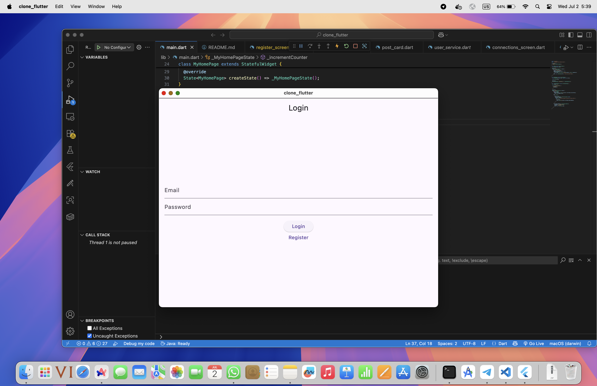
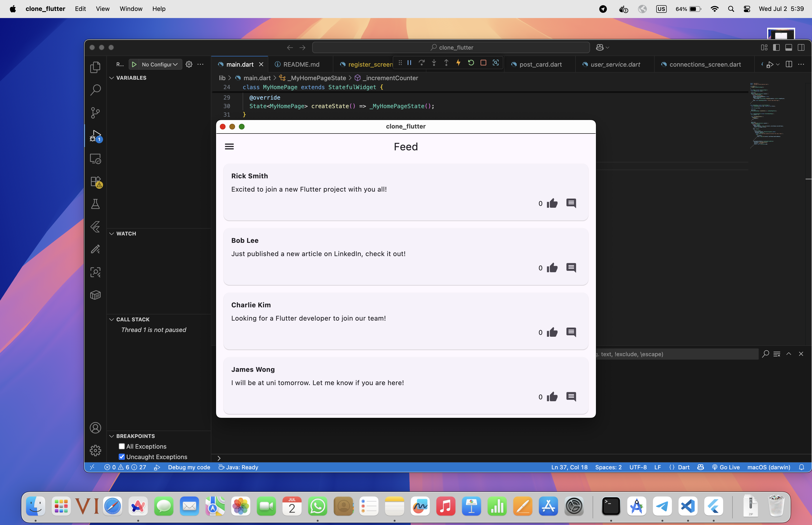
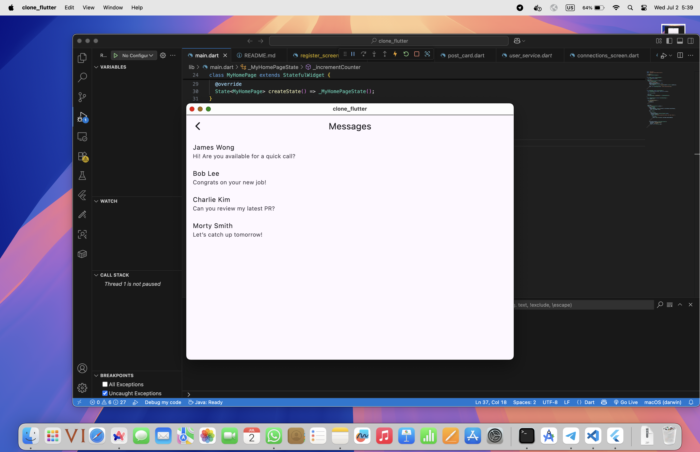

# LinkedIn Clone (Flutter)

This is a functional LinkedIn clone built with Flutter. The project demonstrates a modular approach to building a social network app, focusing on core features and functionality rather than style.

## Screenshots

| Login Screen | Feed | Profile |
|:------------:|:----:|:-------:|
|  |  |  |

## Features
- **Authentication:** Login and registration forms. Only a hardcoded user can log in.
- **Feed:**
  - View a list of hardcoded news posts.
  - Users can like posts.
  - Users can create new posts.
  - Users can leave comments under posts.
- **Profile:**
  - View a hardcoded user profile (Adilkhan Orakbay).
  - Edit your name, profile picture, and description.
- **Connections:** See a list of hardcoded connections.
- **Messages:**
  - View a list of hardcoded messages.
  - Tap a message to read its content.
- **Notifications:** View a list of hardcoded notifications.

## How to Login
- Use the following credentials to log in:
  - **Email:** `aa@gmail.com`
  - **Password:** `1234`
- You can use anything other to register, but profile will be the same

## Project Structure
- `lib/models/` — Data models (User, Post, etc.)
- `lib/services/` — Business logic and data services
- `lib/screens/` — UI screens for each feature
- `lib/widgets/` — Reusable UI components

## Notes
- All data (posts, messages, connections, notifications) is hardcoded for demonstration purposes.
- The UI is kept simple to focus on functionality and structure.

## Updates
- Integrated Firebase with Realtime Database and a Firebase Data Connect services.
- Implemented CRU (without deletion as for now) for basic posting

